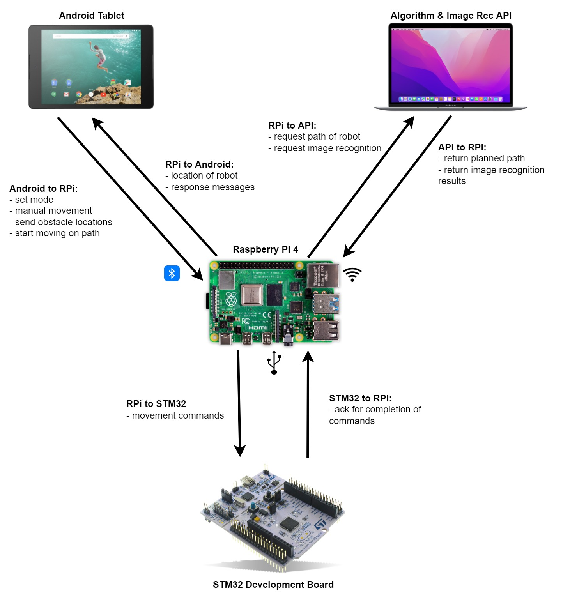

# mdp-raspberrypi
This repository contains the Python scripts for the Raspberry Pi component of the CZ3004 Multi-Disciplinary Project (MDP).

## Topology Diagram


## Raspberry Pi Message formats

### Android to RPi

#### General

##### Set robot mode
```json
{"cat": "mode", "value": "manual"}
{"cat": "mode", "value": "path"}
```

Possible responses:
```json
{"cat": "info", "value": "Robot is now in Path mode."}
{"cat": "info", "value": "Robot is now in Manual mode."}
{"cat": "error", "value": "Robot already in Path mode."}
{"cat": "error", "value": "Robot already in Manual mode."}
```

#### Path Mode Commands
The following commands are only valid if the robot is currently operating in the Path mode. If the robot is in the manual mode, the robot will respond with an error.

```json
{"cat": "error", "value": "Robot must be in Path mode to set obstacles."}
{"cat": "error", "value": "Robot must be in Path mode to start robot on path."}
```

##### Set obstacles
RPi will make a call to the Algorithms API and store the received commands and path.

The contents of `obstacles` together with the configured turning radius (`settings.py`) will be passed to the Algorithm API.<br/>
Please refer to the format for the `/path` endpoint.
Reference: https://github.com/CZ3004-Group-28/Algo

```json
{
  "cat": "obstacles",
  "value": {
    "obstacles": [{"x": 5, "y": 10, "id": 1, "d": 2}],
    "mode": "0"
  }
}
```
Mode:
- `0`: indoors
- `1`: outdoors

##### Navigate around obstacle
RPi will make a call to the Algorithms API and store the received commands and path.
This path only consists of the steps for navigating around the obstacle.
```json
{"cat": "single-obstacle", "value": {"robot" : {"x" : 10, "y" : 7, "d" : 0},"obstacle" : {"x" : 10, "y" : 10}}}
```

##### Start
Signals to the robot to start dispatching the commands (when obstacles were set).
```json
{"cat": "control", "value": "start"}
```

If there are no commands in the queue, the RPi will respond with an error:
```json
{"cat": "error", "value": "Command queue is empty, did you set obstacles?"}
```

#### Manual Mode Commands
The following commands are only valid if the robot is currently operating in the Manual mode. If the robot is in the Path mode, the robot will respond with an error.

```json
{"cat": "error", "value": "Manual movement not allowed in Path mode."}
```

##### Movement commands
Movement commands for the manual mode will set the robot moving indefinitely until a `STOP` command is received.

For example, when the "forward" button is pressed (and held) in the android app, one command `FW--` should be sent and this will make the robot move forward forever. When the user lifts the finger from the "forward" button, another command `STOP` is sent to stop the robot.

```json
{"cat": "manual", "value": "FW--"}
{"cat": "manual", "value": "BW--"}
{"cat": "manual", "value": "TL--"}
{"cat": "manual", "value": "TR--"}
{"cat": "manual", "value": "STOP"}
```

##### Capture image and call Image Recognition API
Pi will immediately capture an image using the camera and make a call to the Image Recognition API.
```json
{"cat": "manual", "value": "MANSNAP"}
```

##### Start Robot on the Fastest Car Challenge
```json
{"cat": "manual", "value": "WN01"}
{"cat": "manual", "value": "WN02"}
```

---

### RPi to Android
The RPi will send messages to the Android app in the following format:
```json
{"cat": "xxx", "value": "xxx"}
```

**Message categories:**
- `info`: general messages
- `error`: error messages, usually in response of an invalid action
- `location`: the current location of the robot (in Path mode)
- `image-rec`: image recognition results
- `mode`: the current mode of the robot (`manual` or `path`)
- `status`: status updates of the robot (`running` or `finished`)

#### Image recognition results
```json
{"cat": "image-rec", "value": {"image_id": "A", "obstacle_id":  "1"}}
```

#### Location Updates
In Path mode, the robot will periodically notify android with the updated location of the robot.

```json
{"cat": "location", "value": {"x": 1, "y": 1, "d": 0}}
```
where `x`, `y` is the location of the robot, and `d` is its direction.

#### Robot Mode
This message is sent to the Android upon the initial Bluetooth connection and subsequent reconnections.
```json
{"cat": "mode", "value": "path"}
{"cat": "mode", "value": "manual"}
```

---

### STM32 to RPi
After every command received on the STM32, an acknowledgement (string: `ACK|xxx`) must be sent back to the RPi.
This signals to the RPi that the STM32 has completed the command, and is ready for the next command.

---

### RPi to STM32
The RPi will only send the following commands to the STM32.

#### Path mode commands
Indoors: High speed forward/backward, with turning radius of `3x1`
- `FW0x`: Move forward `x` units
- `BW0x`: Move backward `x` units
- `FL00`: Move to the forward-left location
- `FR00`: Move to the forward-right location
- `BL00`: Move to the backward-left location
- `BR00`: Move to the backward-right location

Outdoors: Slow speed forward/backward, with turning radius of `3x1` or `4x2` (configurable in `settings.py`)
- `FS0x`: Move forward `x` units
- `BS0x`: Move backward `x` units
- `FL20`: Move to the forward-left location (turning radius `3x1`)
- `FR20`: Move to the forward-right location (turning radius `3x1`)
- `BL20`: Move to the backward-left location (turning radius `3x1`)
- `BR20`: Move to the backward-right location (turning radius `3x1`)
- `FL30`: Move to the forward-left location (turning radius `4x2`)
- `FR30`: Move to the forward-right location (turning radius `4x2`)
- `BL30`: Move to the backward-left location (turning radius `4x2`)
- `BR30`: Move to the backward-right location (turning radius `4x2`)

#### Manual mode commands
- `FW--`: Move forward indefinitely
- `BW--`: Move backward indefinitely
- `TL--`: Steer left indefinitely
- `TR--`: Steer right indefinitely
- `STOP`: Stop all servos

#### Miscellaneous commands
- `ZZ0x`: Buzz the buzzer `x` times

## Buzzer
- 1 buzz  : Robot Mode changed `or` Robot finished path
- 2 buzzes: Bluetooth device connected
- 3 buzzes: Bluetooth disconnected
- 4 buzzes: API is down, start command aborted
